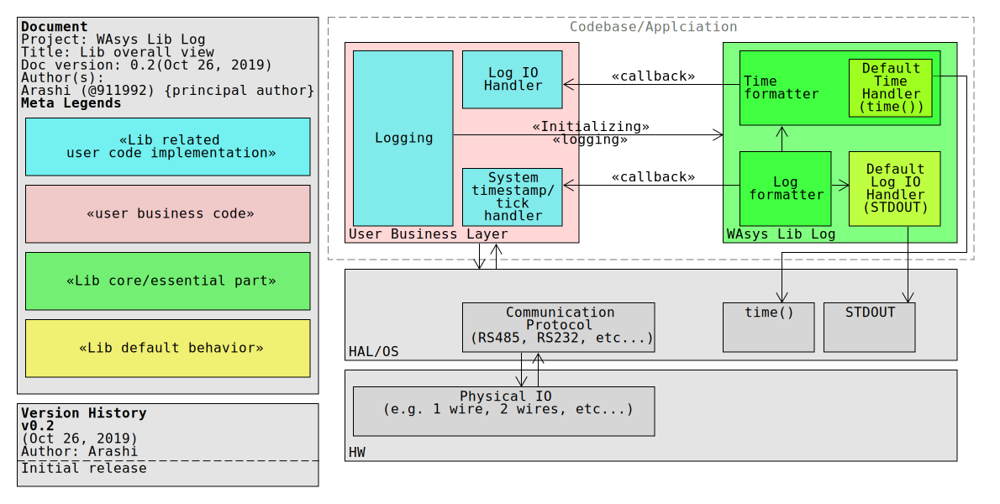

# WAsys_lib_log
Very simple ANSI-C log lib

Compatible with embedded system, where there is no STDOUT

Sample Usage could be found at `WAsys_logging_usage_demo.c`

## Revision History
**Revision 0.3.1** (Jan 26, 2020)
1. Added missed macro define (D__WAsys_logging_usage_demo_activated__) for travis, now build passes

**Revision 0.3** (Jan 24, 2020)
1. Content of file `WAsys_logging_usage_demo.c` is ignored by default, to have the sample usage, define(un-comment) macro `__WAsys_logging_usage_demo_activated__`
2. Fixed some typo and missed meta data (e.g. date of revisions in source/header files)
3. Fixed(updated) project meta data file `WAsys_logging_project_meta.h`
4. There will be no `UB` when lib has not been initialized by any log call(var `_WAsys_logging_lib_initialized`)
5. Added missed comments on static functions
6. Output now is not an exe artifact, instead a static lib(Eclipse project)
7. Changed global `WAsys_msg` global variable into `WAsys_logging_msg`
8. New function `WAsys_log_bytea_hex` to log out a byte array
9. `NULL` ptr now could be logged, lib will print out a special log(`WAsys_NULL_ARGUMENT_LOGGING`, and `WAsys_NULL_BYTEA_ARGUMENT_LOGGING`) for `NULL` arguments(for both simple, and array logging)
10. Added function `WAsys_log_ts` and macro `log_ts` to printout the timestamp only(if applicable)
11. Function `WAsys_logging_init_default` now sets the default timestamp func, to allow WAsys_log_ts work
12. Fixed wrong statements in FAQ in this file
13. Eclipse Project
    1. Added static, shared, and executable(windows/gcc_mingw) configurations
14. Added `__MINGW32__` and `__MINGW64__` macros check for assuming time func could be available(windows/mingw)

**Revision 0.2** (Oct 26, 2019)
1. Fixed linking error, when `time()` function may not be available(for default timestamp logging) | Issue #1 [link](https://github.com/911992/WAsys_lib_log/issues/1)
2. Added `log` and `logf` for easier logging


**Initial Release** (Oct 17, 2019)

## Lib Overview


## FAQ

### Does it print on `STDOUT`?
If logging were initialized using default routines, so `TRUE`, otherwise it will call the associated IO callback.

### Does it support ANSI standard text coloring?
`FALSE`

### Is it thread-safe?
`FALSE`

### Does it flush the output after each logging?
`TRUE`, if lib is initialized the default init way(`STDOUT`, and `time()` func), it will flush the output for every single char(`fflush(STDOUT)`)

### What if I don't initialize the logging, and log something?
Nothing will be happened(Note: lib revision 0.2 and earlier, would have `UB`s when lib is not initialized, but some logs are need to be done)

### Is callback-ed log string(`char*`) `NULL`-terminated?
Yes, but the `arg_len` carries the string length

### Where to change log timestamp format?
Check file `WAsys_logging.h`. Change `WAsys_TIMESTAMP_DATE_FORMAT` and `WAsys_TIMESTAMP_DATE_FORMAT_LEN` macros.
Read comments, otherwise there might be redundant memory usage, or UBs 

## Sample Usage
### X86(*nix/windows) simple log
```c
...
void stdprint(char *arg_buff, size_t arg_len) {
	size_t _a;
	for( _a=0 ; _a < arg_len ; _a++ ){
		putchar(STDOUT,_a);
	}
	/*Or something like(maybe slower)*/
	/*printf("%s",arg_buff);*/
}

int main(int arg_argc,char** arg_args){
	/*Initializing the logging without time stamp, out to STDRR*/
	WAsys_LOGGING_CONF_T _conf;
	/*Need timestamp for each*/
	_conf.including_timestamp = 1;
	/*Using default system time() function*/
	_conf.system_ts_func = NULL;
	/*Function io callback*/
	_conf.callback_func = stdprint;
	/*Should be happens once, but could be re-initialize later*/
	WAsys_logging_init(_conf);
	/*Sample formatted log*/
	WAsys_logf("Happy Programming %x\n", 911);
	/*Sample formatted log*/
	return 0;
}
...
/*
Sample output:
20191018-00:15:34-> Happy Programming 38f
*/
```

### X86(*nix/windows) array log
```c
...
/*printing some sample byte array*/
static void _WAsys_print_out_sample_byte_array(void) {
	/*logging timestamp without a break line*/
	log_ts();
	logf("Logging a simple byte array \n[");
	uint8_t sample_array[] = { 'W', 'A', 's', 'y', 's', '-', 0x20, 0x20, 0x01,
			0x24 };
	log_bytea(sample_array, sizeof(sample_array));
	log("]");
}

int main(int arg_len, char **args) {
	/*Initialize the default logging without timestamp, out to STDOUT*/
	WAsys_logging_init_default();

	_WAsys_print_out_sample_byte_array();
	
	return 0;
}
/*
sample output:
20200124-00:39:17-> Logging a simple byte array 
[57 41 73 79 73 2d 20 20 01 24]
*/
...
```

### AVR (ATmel 8) using serial
AVR logging(debugging) using serial
From uC to PC(using serial)

```c
...

/*Where this var is handled(incremented) by a timer interrupt, in ms*/
uint32_t systicks;

void putchar_uart0(char c)
{
while ((UCSR0A & DATA_REGISTER_EMPTY)==0);
UDR0=c;
}
...
/*Logging fucntions - begin*/
void wasys_print(char *arg_buff, size_t arg_len) {
	size_t _a;
	for( _a=0 ; _a < arg_len ; _a++ ){
		putchar_uart0(_a);
	}
}

time_t wasys_systemtick(void){
	/*Convert current times in ms to seconds, and return it*/
	return (time_t)(systicks/1000);
}

/*Logging fucntions - end*/

int main(){
...
	/*Initializing the logging without time stamp, out to STDRR*/
	WAsys_LOGGING_CONF_T _conf;
	/*Need timestamp for each*/
	_conf.including_timestamp = 1;
	/*Using wasys_systemtick function*/
	_conf.system_ts_func = wasys_systemtick;
	/*Function io callback*/
	_conf.callback_func = wasys_print;
	/*Should be happens once, but could be re-initialize later*/
	WAsys_logging_init(_conf);
	/*Sample formatted log*/
	WAsys_log("Happy AVR Programming");
	/*Sample formatted log*/
...
}

...
```

### STM32
A good and detailed blog about it, could be found [here (https://arashmd.blogspot.com/2019/10/logging-and-debugging-stm32-using-serial.html)](https://arashmd.blogspot.com/2019/10/logging-and-debugging-stm32-using-serial.html). Hope you find it great.

## Troubleshooting

### UB/`SEGFAULT` by `WAsys_logf`
By default, the amount for formatting log is 64(see `_MSG_LEN_DEFAULT` and `_MSG_LEN`) in `WAsys_logging.h` file.
If the required string length(see `WAsys_msg`) for asked format is not significant enough, you might have some UB/`SEGFAULT` if compile in ANSI-C, but if you compile it in c11, it will be safe, but results trimmed message.

### Trimmed/truncated log data by `WAsys_logf`
By default, the amount for formatting log is 64(see `_MSG_LEN_DEFAULT` and `_MSG_LEN`) in `WAsys_logging.h` file.

### UB/`SEGFAULT` by `WAsys_log` or `WAsys_log_br`
If lib rev 0.2 or earlier is being used then, make sure you have initialized the logging right(or used the default ones)

### I don't log formatted message
So please change `WAsys_USE_GLOBAL_MSG_VAR` macro to 0 in `WAsys_logging.h`

